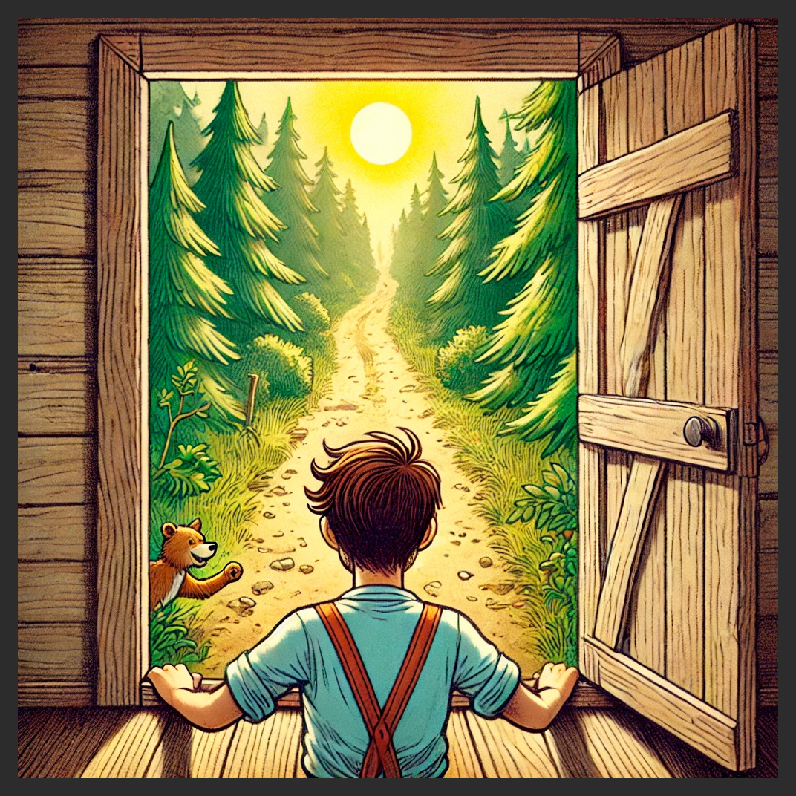
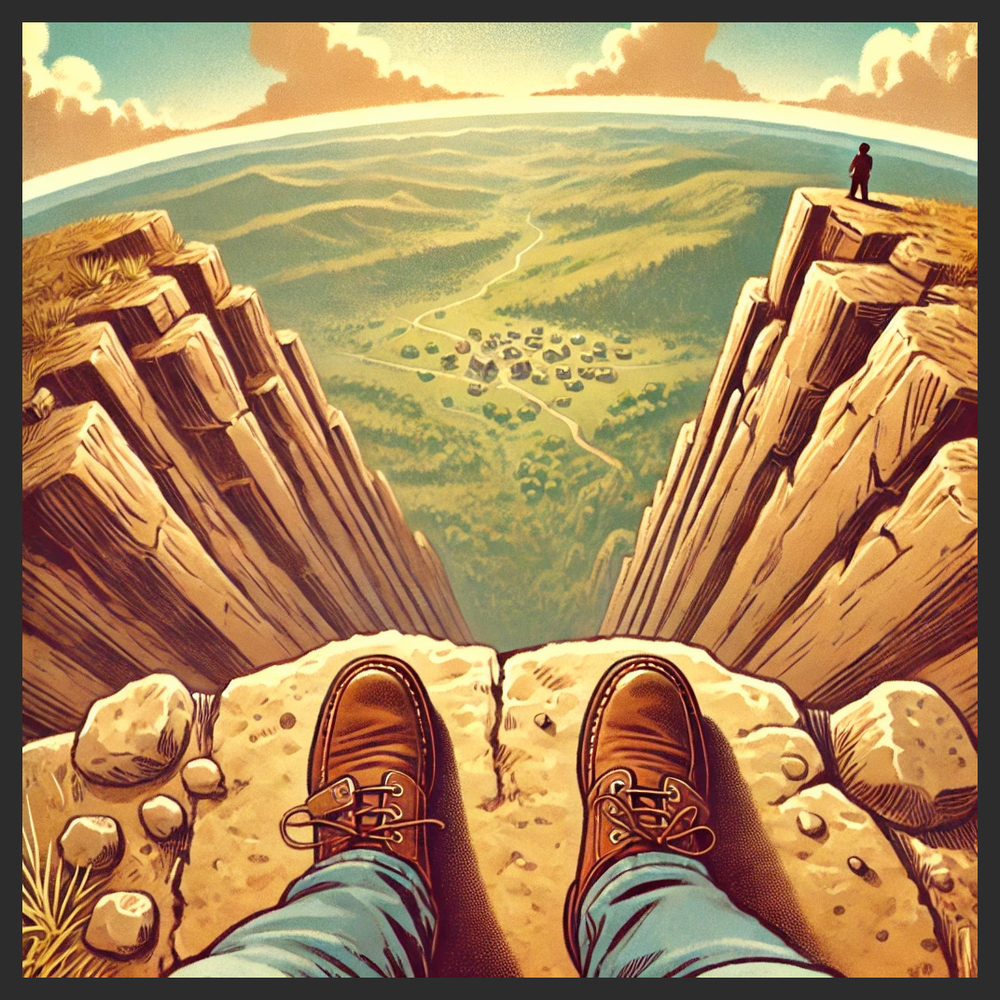

# AparallaxTale

A parallax story about a transformative journey filled with adventure and friendship.


---

## Storyboard

[View the Storyboard](https://app.napkin.ai/page/CgoiCHByb2Qtb25lEiwKBFBhZ2UaJGRhNDI5YWYwLWUyNDUtNGJmMC04ZjkxLTc5MTRmZDdlNDI1Mg?s=1)

---

## Overview

_A Parallax Tale_ is a **work-in-progress** story that will be brought to life using pure HTML and CSS, without the use of any frameworks or libraries. This project showcases the power of CSS in creating engaging parallax effects and smooth animations to narrate a captivating journey.

In this tale, the protagonist starts in his bed, wakes up, moves out of his house, walks to a cliff, and looks over it to see a distant village. He begins climbing down and meets various characters—a goose, a giant furry monster, a snake, and more. An unexpected event traps him at the bottom, but the friends he made along the way assist him in climbing back up, leading to a heartfelt conclusion.

---

## Table of Contents

- [Scenes](#scenes)
  - [Scene 1: Wake-up (in bed)](#scene-1-wake-up-in-bed)
  - [Scene 2: Leaving the House](#scene-2-leaving-the-house)
  - [Scene 3: Walking Towards the Cliff](#scene-3-walking-towards-the-cliff)
  - [Scene 4: Looking Over the Cliff](#scene-4-looking-over-the-cliff)
  - [Scene 5: Starting the Descent](#scene-5-starting-the-descent)
  - [Scene 6: Meeting the Goose](#scene-6-meeting-the-goose)
  - [Scene 7: Encountering the “Monster”](#scene-7-encountering-the-monster)
  - [Scene 8: The Snake Encounter](#scene-8-the-snake-encounter)
  - [Scene 9: Trapped at the Bottom](#scene-9-trapped-at-the-bottom)
  - [Scene 10: Friends Come to the Rescue](#scene-10-friends-come-to-the-rescue)
  - [Scene 11: The Ascent](#scene-11-the-ascent)
  - [Scene 12: Back at the Top, Reflecting](#scene-12-back-at-the-top-reflecting)
- [Additional Scene Details](#additional-scene-details)
- [Technologies Used](#technologies-used)
- [Project Status](#project-status)
- [Contributing](#contributing)
- [License](#license)
- [Live Demo](#live-demo)

---

## Scenes

### Scene 1: Wake-up (in bed)

The scene begins with a simple CSS animation of the protagonist waking up in bed.

- **Animation:** Eyes open slowly, the character sits up.
- **Transition:** Character gets out of bed, stretches.
- **Background:** Cozy bedroom, morning light coming through the window.

#### Visuals:


---

### Scene 2: Leaving the House

- **Animation:** The character opens the door and steps outside.
- **Transition:** The camera follows the character as he walks through the doorway and into the open world.
- **Background:** Green fields, the house shrinking in the distance.

#### Visuals:


---

### Scene 3: Walking Towards the Cliff

- **Animation:** The character walks in a side-scrolling style across the landscape.
- **Transition:** The cliff in the distance gets closer as the scene scrolls.
- **Background:** The village far below the cliff comes into view. Birds flying in the distance.

#### Visuals:


---

### Scene 4: Looking Over the Cliff

- **Animation:** The character stops at the cliff’s edge and peers over it.
- **Transition:** The camera zooms out to reveal the vast village below.
- **Background:** Vast drop below, mist, and the distant sight of a village at the bottom.

#### Visuals:


---

### Scene 5: Starting the Descent

- **Animation:** The character begins to climb down.
- **Transition:** The camera follows his descent slowly.
- **Background:** Rocky walls, foliage, and small ledges for resting.

#### Visuals:


---

### Scene 6: Meeting the Goose

- **Animation:** The character encounters a goose. The goose squawks and offers a short conversation in speech bubbles.
- **Transition:** The goose flies ahead, showing a safe path to follow.
- **Background:** The cliff's rough terrain continues.

#### Visuals:


---

### Scene 7: Encountering the “Monster”

- **Animation:** A large, furry monster emerges from a cave on the side of the cliff. It's friendly but intimidating.
- **Transition:** The monster offers to clear debris blocking the path. They work together to move forward.
- **Background:** A cave opening and rocky surroundings.

#### Visuals:


---

### Scene 8: The Snake Encounter

- **Animation:** The character comes across a large snake coiled around a rock. The snake speaks and offers advice on how to proceed.
- **Transition:** The snake uncurls and slithers away, revealing a hidden path.
- **Background:** The path now becomes more treacherous, with rocks falling.

#### Visuals:


---

### Scene 9: Trapped at the Bottom

- **Animation:** The character reaches the bottom but gets trapped by a rockfall. He is unable to climb back up.
- **Transition:** The screen darkens as the situation becomes dire.
- **Background:** Dark, claustrophobic surroundings, rocks blocking the way out.

#### Visuals:


---

### Scene 10: Friends Come to the Rescue

- **Animation:** The goose, monster, and snake return to help. The goose scouts ahead, the monster lifts heavy rocks, and the snake finds a way through.
- **Transition:** The friends clear the path and lead the protagonist to safety.
- **Background:** The path is cleared, and the character begins his ascent back up the cliff.

#### Visuals:


---

### Scene 11: The Ascent

- **Animation:** With the help of his friends, the character climbs back up to the top.
- **Transition:** The camera pans up as they climb together.
- **Background:** Blue skies and sunshine as they near the top.

#### Visuals:


---

### Scene 12: Back at the Top, Reflecting

- **Animation:** The character and his friends stand at the top of the cliff, looking out over the village.
- **Transition:** A sense of peace and accomplishment. The camera zooms out to show the vast landscape.
- **Background:** Sunset over the village, peaceful ending scene.

#### Visuals:


---

## Additional Scene Details

### Scene 1:

- **Details:**
  - Looking at the bad guy sleeping, maybe some Z’s popping out.
  - Zoom into the guy's head, camera rotates, guy sits up—you’re looking out of his eyes.
  - You see darkness as his hands rub off his tired eyes and move out of the way; you’re looking at the cabin.

### Scene 2:

- **Details:**
  - The door opens, you see the bright outside.
  - The camera moves in towards it as it gets closer.
  - The bright door gets bigger (sun rays casting through) and it comes into focus looking at the great outdoors.

### Scene 3:

- **Details:**
  - The camera pans left and right and looks around, forest on either side, a dusty trail ahead.
  - A dusty trail leads ahead with some clouds in the view.
  - Third person as the guy walks down the trail, clouds move around, sun moves a little.

### Scene 4:

- **Details:**
  - As you approach, clouds move away.
  - Once you reach the edge, the camera zooms into the guy's eyes and he looks out over the clouds; they move around.
  - The camera pans down and sees the cliff at the foot, village at the bottom, perhaps a character traveling on the dusty trail.
  - This could be where he meets the goose, flying up the tall cliff and telling him that it’s a very long journey and a man with legs probably couldn't make it because he doesn't have wings. Maybe he gives him a feather?

### Scene 5/6:

1. **Details:**
   - The camera zoom turns around (from the character's feet to stare at his face).
   - The guy ducks down out of view. The camera pulls out and he’s climbing down the cliff.
2. **Details:**
   - The man begins climbing down, arms, legs, etc.
   - The sun maybe continues to set and cast a shadow.
   - As he climbs down, a giant figure comes out sideways (cliff on right, giant scary hand touches cliff, giant monster face black with big glowing yellow eyes comes out because sun shadow silhouette).

### Scene 7:

- **Details:**
  - The guy puts his hand over his eyes to shield the sun (to transition to the monster's face).
  - As his hand comes up, the black shadow opacity pulls back and it's a fuzzy brown monster with yellow eyes and two teeth and a big smile.
  - Dialogue of some sort. Perhaps the monster gives him fur?

### Scene 8:

- **Details:**
  - The descent continues.
  - Perhaps an encounter with a snake? A mouse might be more fitting?
  - More dialogue? A fox warning him of impending doom?

### Further Scenes…

- Reaches the bottom and it's full of rocks.
- Trapped in rocks.
- Reaches the village.
  - The village is old and overgrown and not active.
  - The woman (his mom?) he was looking for is not there.
- Some foxes or wolves make sounds.
- Some true danger.
- He has to run back quickly towards his house.
- A storm occurs.
- Some monsters circle him.
- He gets trapped in rocks.
- Somebody swoops in and saves, scares away the bad guys.
- He slips and is injured.
- The fox helps him drag/ride back to the cliff (legs hurt).
- His arms injured from wolf attack? Begins trying to climb and falls.
- The water erosion pushes him down and he falls onto his back.
- The monster gets the rocks off and takes him to the top (or at least above the storm to the cave where he met him and they shelter for the night).
- He’s still injured.
- The goose helps him fly back to the top on his back.
- The mouse brings him some berries or food or something once he reaches the top because he's hungry.
- He walks back to his house.
- The person he was looking for is there.

---

## Technologies Used

- **HTML5:** Structuring the content of the story.
- **CSS3:** Styling and creating parallax effects and animations.
- **No Frameworks or Libraries:** The project is built entirely with pure HTML and CSS to showcase fundamental web development skills.

---

## Project Status

This project is a **work in progress**. The story is currently outlined and scenes are being developed with corresponding HTML and CSS implementations. Future updates will include the completion of all scenes, enhanced animations, and fine-tuning of the parallax effects to deliver a seamless and immersive storytelling experience.

---

## Contributing

Contributions are welcome! If you'd like to contribute to _A Parallax Tale_, please follow these steps:

1. **Fork the Repository**
2. **Create a New Branch**
   ```bash:index.html
   git checkout -b feature/YourFeature
   ```
3. **Commit Your Changes**
   ```bash:index.html
   git commit -m "Add Your Feature"
   ```
4. **Push to the Branch**
   ```bash:index.html
   git push origin feature/YourFeature
   ```
5. **Open a Pull Request**

Please ensure your contributions adhere to the project's coding standards and include appropriate documentation.

---

## License

This project is open-source and available under the [MIT License](LICENSE).

---

## Live Demo

Check out the live version of _A Parallax Tale_ on [GitHub Pages](https://arkdouglas.github.io/aparallaxtale/).

---

**Note:** Ensure that all image files (e.g., `scene-1.png`, `scene-2.png`, etc.) are placed inside the `images` folder within your project directory. This setup will allow the visuals to render correctly in the README and the HTML pages.